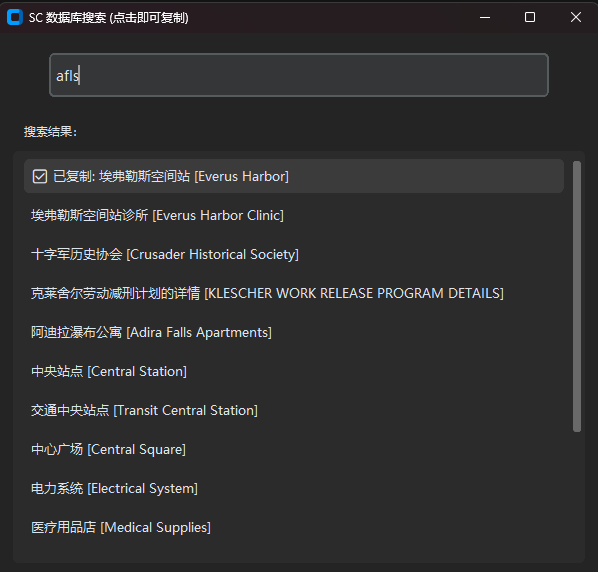

# SC 数据库模糊搜索工具

一个为《星际公民》(Star Citizen) 玩家开发的轻量级数据库搜索工具。支持中英文、全拼及拼音首字母快速搜索，并支持点击自动复制，以方便玩家能够快速在第三方网站、交易网站中找到需要的物品




### ✨ 功能特点
- **智能搜索**：支持中文、全拼（`xinbabeiqi`）、简拼（`xbbq`）以及模糊匹配。
- **权重优化**：自动识别核心词条，短词优先展示（如“新巴贝奇”会排在“新巴贝奇星际空港”之前）。
- **一键复制**：点击搜索结果即可自动复制到剪贴板，并提供视觉反馈。
- **现代 UI**：基于 CustomTkinter 开发，适配 Windows 11 深色模式。
- **单文件分发**：支持打包成独立 EXE，内置数据库，无需安装 Python 环境。

### 🛠️ 技术栈
- Python 3.11
- GUI: `CustomTkinter`
- 搜索匹配: `RapidFuzz`
- 拼音处理: `PyPinyin`
- 剪贴板: `Pyperclip`

### 📥 数据说明
本项目使用的 `data.txt` 数据来源于 **“sc汉化盒子”**。感谢汉化团队的辛勤付出。
*注：数据仅供学习与交流使用，版权归原作者所有。*

### 🚀 如何运行
1. 安装依赖：
   ```bash
   pip install -r requirements.txt
2. 运行程序：
   ```bash
   python app.py
3. 打包程序
    ```bash
    py -m PyInstaller --noconsole --onefile --collect-all customtkinter --add-data "data.txt;." --name "SC_DB_Searcher" --clean sc_searcher.py
